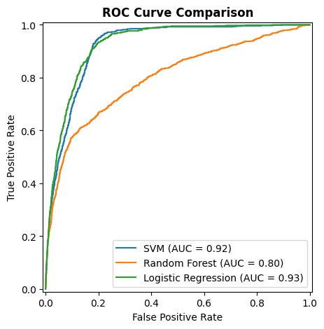

# Bank Marketing Campaign Predictions


This project predicts which bank clients are likely to subscribe to a term deposit after a marketing call, with a focus on maximizing recall while controlling campaign costs.

## Project Overview
This repository compares different machine learning models to classify client responses (deposit vs no deposit).  

The models include:

- **Support Vector Machine (SVM)**
- **Random Forest Classifier**
- **Logistic Regression**

## Why these models?
I mainly chose Logistic Regression for interpretability, SVM to maximize recall, and Random Forest for non-linear patterns.

## Data Sources
- UCI Bank Marketing Dataset (`bank-additional-full.csv`)
- [Dataset link](https://www.kaggle.com/datasets/sahistapatel96/bankadditionalfullcsv/data)  
- Contains client demographic data, call duration, campaign info, and economic indicators

All dataset files are stored in the `data/` folder.

## How It Works
- Run `EDA.ipynb` first to analyze the data, detect outliers, and generate `data/cleaned_data.csv`.
- Run `main.py` which loads the cleaned data.
- The script applies scaling/encoding via pipelines and trains SVM, Logistic Regression, and Random Forest.
- The main file runs all the python files with classes and functions to train the models and save them in the `models/` folder.

## Model Validation Strategy

To ensure robust evaluation under class imbalance (11.3% positive class), model selection and hyperparameter tuning were performed using:

- StratifiedKFold (k=5)
- ROC-AUC as the scoring metric
- Class weights where appropriate

StratifiedKFold guarantees that each fold maintains approximately the same positive/negative class ratio, reducing variance and preventing optimistic bias.

## Results & Model Performance

### Dataset Overview
- **Total samples**: 41,189
- **Number of features**: 20
- **Positive class (subscription)**: 11.3%

---

### Best Models After Hyperparameter Tuning (ROC-AUC)

| Model | Best ROC-AUC | Best Hyperparameters |
|------|-------------|----------------------|
| Random Forest | 0.798 | `n_estimators = 200`, `max_depth = 20`, `min_samples_leaf = 1` |
| SVM | 0.919 | `C = 1`, `gamma = 0.01`, `kernel = "rbf"`|
| Logistic Regression | 0.921 | `C = 0.1`, `penalty = "l1"`, `solver = "liblinear"` |

---

### ROC Curve Comparison

- The ROC curve shows that Logistic Regression achieves an AUC of 0.93, SVM 0.92, and Random Forest 0.80. 
- Overall, a better AUC means better separation of subscribers and non-subscribers.



---
### Threshold Analysis — Logistic Regression (Best Model)

Since the business goal is to maximize recall, and the model with the highest AUC is Logistic Regression, I swept thresholds to find the optimal recall–precision tradeoff.

| Threshold | Precision | Recall | F1    | FPR   |
|:---------:|:---------:|:------:|:-----:|:-----:|
| 0.20      | 0.261     | 0.971  | 0.411 | 0.198 |
| 0.25      | 0.298     | 0.958  | 0.454 | 0.163 |
| 0.30      | 0.341     | 0.941  | 0.501 | 0.131 |
| 0.35      | 0.385     | 0.907  | 0.540 | 0.104 |
| 0.40      | 0.421     | 0.878  | 0.569 | 0.087 |
| 0.45      | 0.432     | 0.856  | 0.575 | 0.080 |
| 0.50      | 0.432     | 0.843  | 0.572 | 0.079 |

> Optimal threshold: 0.35 — captures 90.7% of subscribers (TPR), while keeping the False Positive Rate (FPR) at 10.4%
---

### Notes on Model Interpretation

High Accuracy vs Low Recall: Even with class_weight='balanced' and stratified splits, the model still misses many clients who actually subscribe. 
This happens because the default classification threshold prioritizes overall accuracy. Lowering it (to improve recall) enhances true positive detection.

- **Business Context of Errors**:  
  - **Wasted calls (Type I errors)**: calls made to clients who would not subscribe  
  - **Lost clients (Type II errors)**: potential subscribers not predicted by the model  

Here the focus should be on maximizing recall for positive clients, since missing a potential subscriber is more costly than an extra call.

---

### Business Impact Summary (Logistic Regression with threshold => 0.35)

- **Wasted calls (Type I Error)**: 1,100
- **Lost clients (Type II Error)**: 95
- **Recall achieved**: 90.7%
- **FPR**: 10.4%

> Compared to calling all clients indiferently, this model still capturing 90.7% of all subscribers, while reducing considerely the number of calls.
---

## File Structure
```
.
├── data/
│   ├── bank-additional-full.csv
│   └── cleaned_data.csv
├── models/
│   ├── best_logreg_model.pkl
│   ├── best_rf_model.pkl
│   └── best_svm_model.pkl
├── viz/
├── .gitignore
├── EDA.ipynb
├── LICENSE
├── main.py
├── modeling.py
├── README.md
├── requirements.txt
├── utils.py
└── visualization.py
```

## Dependencies
- pandas
- matplotlib
- seaborn
- scikit-learn
- joblib

All dependencies can be installed via:

```bash
pip install -r requirements.txt
```

## Model Saving
- The best models are saved using `joblib` for future predictions, you can find it in the `models/` folder.
- To open a `.pkl` in python, copy this code:
```python
import joblib

for f in ["best_rf_model.pkl", "best_svm_model.pkl", "best_logreg_model.pkl"]:
    model = joblib.load(f"models/{f}")
    print(f"\n{f}:")
    print(model)
    print(model.get_params())
```

## License
This project is licensed under the MIT License.
